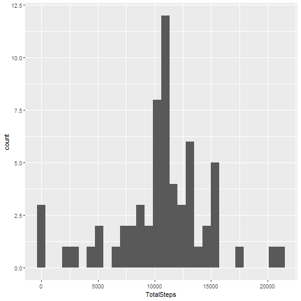

In this report, I perform an analysis of personal activity monitoring device.
This data is freely available of my github.


``` r
# Install necessary libraries
library(dplyr)
library(ggplot2)
```

First we load the data and take a look at it:

``` r
activityData <- read.csv('activity.csv') 

str(activityData)
```

```
## 'data.frame':	17568 obs. of  3 variables:
##  $ steps   : int  NA NA NA NA NA NA NA NA NA NA ...
##  $ date    : chr  "2012-10-01" "2012-10-01" "2012-10-01" "2012-10-01" ...
##  $ interval: int  0 5 10 15 20 25 30 35 40 45 ...
```

One the variables, **steps**, contains missing values which are stored as NA. I will perform a transformation of the date to a POSIXct object.


``` r
activityData = activityData %>% 
  mutate(date = seq(from = as.POSIXct('2012-10-01 00:00'), by= '5 min', length.out = nrow(activityData)))
```


### **Question 1:** What is the mean total number of steps taken per day?
For this part, we are going to ignore the missing values in the dataset and convert the date to an appropriate format.


``` r
totalDaily <- activityData %>% 
  mutate(date = as.Date(date)) %>% group_by(date) %>%
  summarise(TotalSteps = sum(steps, na.rm=TRUE))
```

I transformed the `activityData` so that I can be able to answer the question of **'Total number of steps taken per day'**. Below I will make a histogram plot using **ggplot2** library.


``` r
ggplot(totalDaily, aes(TotalSteps)) + geom_histogram()
```

```
## `stat_bin()` using `bins = 30`. Pick better value with `binwidth`.
```


The mean of the total number of steps taken per day is 9203.4,  while the median is 10340. The histogram looks normal, except for the large number of zero value to the right. This is most likely as a result of missing values.

### **Question 2:** What is the average daily activity pattern?


``` r
averageDaily <- activityData %>% group_by(interval) %>%
  summarise(steps = mean(steps, na.rm=TRUE))

ggplot(averageDaily, aes(interval, steps)) + geom_path()
```


``` r
averageDaily = averageDaily %>% arrange(desc(steps))
```

The 5-minute interval with the highest number of steps is 835


### **Question 3:** What is the total number of missing values in the dataset?

The toal number of missing values in the dataset is **2304**. Only **0.13** of the values in **steps** are missing, which is not too bad. 

I am going to fill NA values by using the mean of that day.


``` r
averageDaily <- activityData %>% group_by(interval) %>%
  summarise(steps = mean(steps, na.rm=TRUE))

interval_means = averageDaily$steps
names(interval_means) = averageDaily$interval

fillNA = function(row) {
  steps = activityData$steps[row]
  if(!(is.na(steps))){
    return(steps)
  }
  
  interval = activityData$interval[row]
  steps = interval_means[as.character(interval)]
  if(is.na(steps)) {
    return(0)
  } 
  return(steps)
}

tidyData <- activityData

tidyData$steps <- sapply(
  1:nrow(tidyData),
  fillNA
)
```

Next, I will make a histogram of the total number of steps taken each day but with missing data filled in.


``` r
totalDailyadj <- tidyData %>% 
  mutate(date = as.Date(date)) %>% group_by(date) %>%
  summarise(TotalSteps = sum(steps, na.rm=TRUE))


ggplot(totalDailyadj, aes(TotalSteps)) + geom_histogram()
```

```
## `stat_bin()` using `bins = 30`. Pick better value with `binwidth`.
```



The mean of the total number of steps taken per day for the original was **9203.4**,  while the median is **10340**, while the mean of the total number of steps taken per day for the new dataset is **10592.5**,  while the median is **10760**. And the histogram a less skewed to the right, hence by imputing missing data we get a more 'normal looking' histogram, which is what we would expect.

### **Question 4:** Are there differences in activity patterns between weekdays and weekends?


``` r
tidyData <- tidyData %>%
  mutate(date = as.Date(date)) %>%
  mutate(day=weekdays(date)) %>% 
  mutate(weekend = (day %in% c('Saturday', 'Sunday')) ) %>%
  mutate(weekend = factor(weekend, labels=c('Weekday', 'Weekend'))) %>%
  group_by(interval, weekend) %>%
  summarise(steps = mean(steps))
```

```
## `summarise()` has grouped output by 'interval'. You can override using the `.groups`
## argument.
```

``` r
ggplot(tidyData, aes(interval, steps)) + geom_path() +
  facet_grid(cols = vars(weekend))
```


